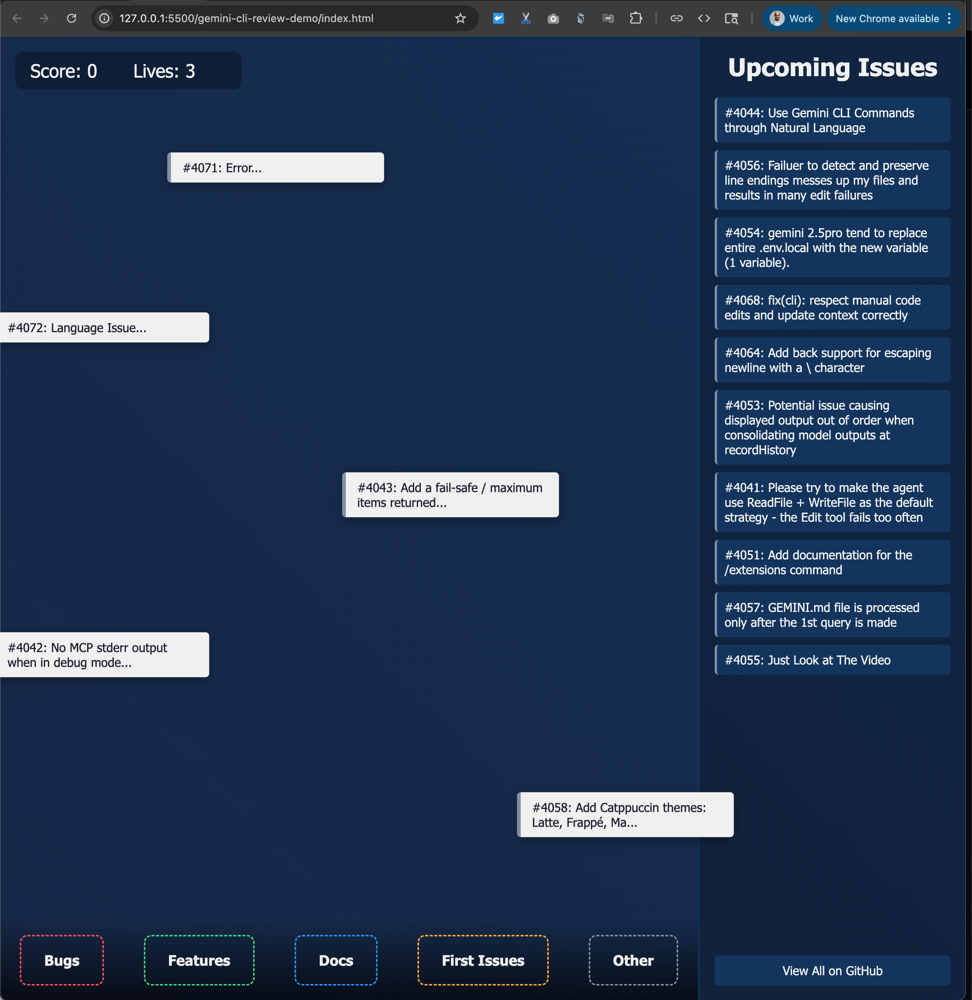
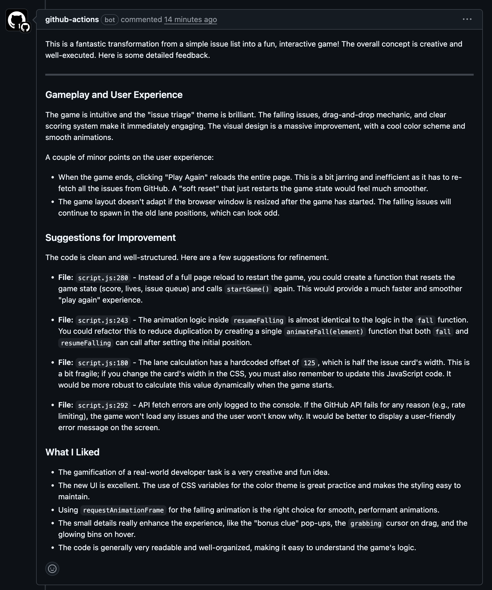

# Gemini-CLI Issue Tracker

This is a simple, fun, and creative front-end web application that displays the open issues from the [google-gemini/gemini-cli](https://github.com/google-gemini/gemini-cli) GitHub repository.

## Features

*   **View Open Issues**: See a list of all open issues from the gemini-cli repository.
*   **Creative Styling**: A fun and visually engaging interface.
*   **Direct Links**: Click on an issue to go directly to the issue on GitHub.
*   **Labels**: Issues are displayed with their corresponding labels.

## Experiment: Gemini CLI for Code Review

This repository is also an experiment to test the capabilities of the `gemini-cli` as an automated code review agent. A GitHub Actions workflow is set up to review pull requests using the Gemini CLI and post the feedback as a comment.

## Demo Concept: Vibe Coded Game and AI Code Review

This repository serves a dual purpose:

1.  **An Interactive Web Application:** A front-end application for triaging issues from the Gemini CLI repository. A live demo is available at: [https://pauldatta.github.io/gemini-cli-review-demo/](https://pauldatta.github.io/gemini-cli-review-demo/)

    

2.  **A Demonstration of AI-Powered Code Review:** The project demonstrates how the Gemini CLI can be used as an automated code review tool. When a pull request is opened, a GitHub Action triggers the Gemini CLI to perform a code review and post its feedback directly on the pull request.

    

    An example of the AI's review comment can be found in [Pull Request #2](https://github.com/pauldatta/gemini-cli-review-demo/pull/2).

    The implementation is in the following files:
    - **Workflow File:** [.github/workflows/code-review.yml](.github/workflows/code-review.yml) - This file defines the GitHub Action that triggers the review.
    - **Review Script:** [scripts/code-review.sh](scripts/code-review.sh) - This script contains the logic for the code review.

    To use this in your own repository, you'll need to add the following secrets to your GitHub repository's settings:
    - `GH_TOKEN`: A GitHub token with `pull-requests: write` permissions.
    - `GEMINI_API_KEY`: Your API key for the Gemini API.

## How to View

Since this is a completely front-end application, you can open the `index.html` file directly in your web browser to see it in action.

Alternatively, you can host it on a static web hosting service like GitHub Pages.
